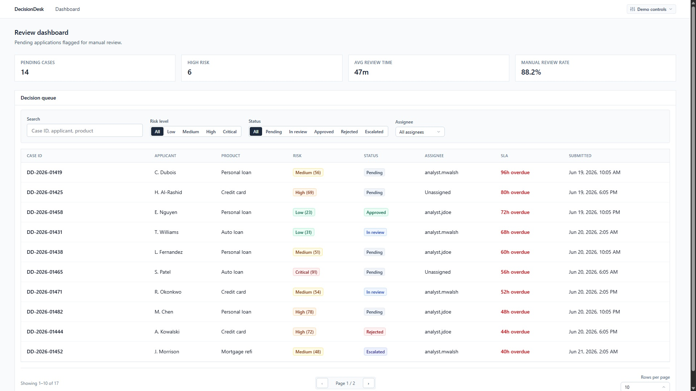
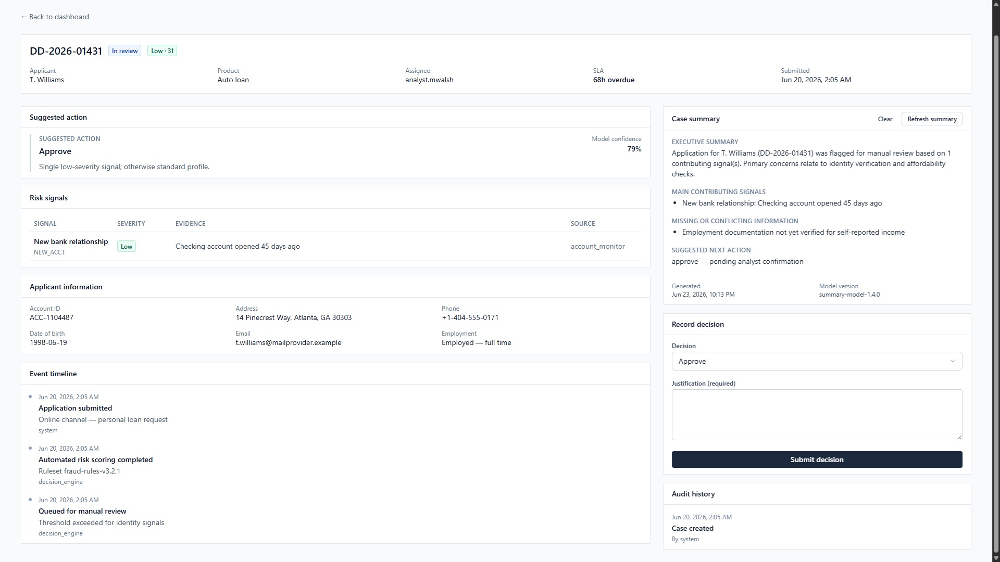
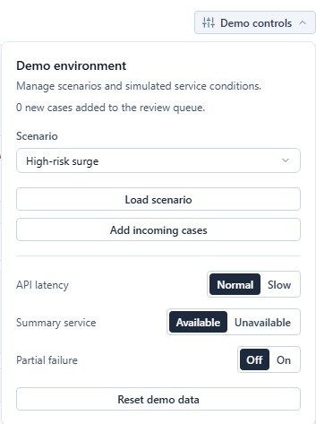

# DecisionDesk


Enterprise risk-review workspace for analyzing flagged applications, reviewing risk signals, and recording auditable decisions.

> **Demonstration project.** All applicants, accounts, metrics, and case IDs are fictional. This is not a production system and is not affiliated with any credit bureau or fraud vendor.



## Key capabilities

- **Review dashboard** — filter and sort a decision queue with risk, status, assignee, and SLA context.
- **Case review** — inspect signals, applicant data, event timeline, and model rationale.
- **Structured summary** — simulated streaming summary with contributing signals and suggested next steps.
- **Auditable decisions** — approve, reject, or escalate with required justification and append-only audit history.
- **Demo controls** — load deterministic scenarios, inject incoming cases, reset data, and simulate latency or service failures.

## Demo workflow

Dashboard → filter queue → open case → generate summary → record decision → audit history updates.

<p align="center">
  <a href="./docs/assets/demo-flow.gif">
    
  </a>
</p>

## Architecture

```
Browser UI (React)
    ↓ hooks / TanStack Query
RiskProvider (MockRiskProvider)
    ↓ fetch
Next.js API routes
    ↓
In-memory demo session store (hydrated from localStorage)
```

- **UI** — presentational components in `src/components/`; feature hooks in `src/features/`.
- **Domain** — canonical types in `src/services/risk-provider/types.ts`, validated with Zod at API boundaries.
- **Integration** — `RiskProvider` abstraction; swap `MockRiskProvider` for a real HTTP client without UI changes.
- **Demo session** — versioned snapshot in `localStorage`, synced to the server store on boot and after mutations. Scenario seeds use relative SLA offsets materialized once on load/reset.

See [docs/README.md](./docs/README.md) for architecture notes and ADRs.

## Screenshots

### Review dashboard


### Case review



### Demo controls



## Tech stack

| Layer | Choice |
|-------|--------|
| Framework | Next.js 16 (App Router), React 19, TypeScript strict |
| Styling | Tailwind CSS v4 |
| Data fetching | TanStack Query |
| Forms | React Hook Form + Zod |
| Tests | Vitest, React Testing Library, Playwright |

## Run locally

**Requirements:** Node.js ≥ 22, viewport ≥ **768px** (tablet/desktop layout only; no mobile shell).

```bash
npm install
npm run dev
```

Open [http://localhost:3000](http://localhost:3000).

## Scripts

| Command | Purpose |
|---------|---------|
| `npm run dev` | Development server |
| `npm run build` | Production build |
| `npm run typecheck` | TypeScript strict check |
| `npm run lint` | ESLint |
| `npm run test` | Vitest unit/component tests |
| `npm run test:e2e` | Playwright end-to-end tests |

## Test strategy

- **Unit / component** — schemas, queue sorting, demo session storage, summary streaming, demo controls.
- **E2E** — dashboard filters → case detail → generate summary → submit decision → audit entry.

## Trade-offs

| Choice | Rationale |
|--------|-----------|
| Mock API + session store | Deployable demo without a database; realistic client/server split |
| RiskProvider abstraction | Swap mocks for internal decisioning APIs without UI refactors |
| Relative SLA seeds | Scenarios stay realistic over time without fixed dates aging out |
| Simulated summary stream | Demonstrates progressive loading without a paid LLM dependency |
| No auth in demo | Focus on analyst workflow; production would use OIDC/SAML |

## Limitations

- **Viewport** — minimum supported width is **768px**; smaller screens show an unsupported-viewport message.
- **Persistence** — demo state survives refresh via `localStorage`, but serverless cold starts reset the in-memory store until the client re-hydrates.
- **Identity** — single hardcoded analyst (`analyst.jdoe`); no RBAC.
- **Scope** — no real fraud engine, credit bureau, or production PII.

## Production considerations

- Replace `MockRiskProvider` with an HTTP implementation against internal APIs.
- Persist cases and append-only audit log in an operational database.
- Authenticate analysts; bind `analystId` from session claims.
- Plug a real summary provider behind the same structured response contract.

## Documentation

| Document | Content |
|----------|---------|
| [docs/README.md](./docs/README.md) | Documentation index |
| [docs/architecture/ARCHITECTURE.md](./docs/architecture/ARCHITECTURE.md) | Stack, boundaries, trade-offs |
| [docs/frontend-standards.md](./docs/frontend-standards.md) | Component and testing standards |
| [docs/decisions/0001-risk-provider-abstraction.md](./docs/decisions/0001-risk-provider-abstraction.md) | ADR: RiskProvider |
| [docs/decisions/0002-demo-session-persistence.md](./docs/decisions/0002-demo-session-persistence.md) | ADR: Demo session persistence |

## License

[MIT](./LICENSE)
